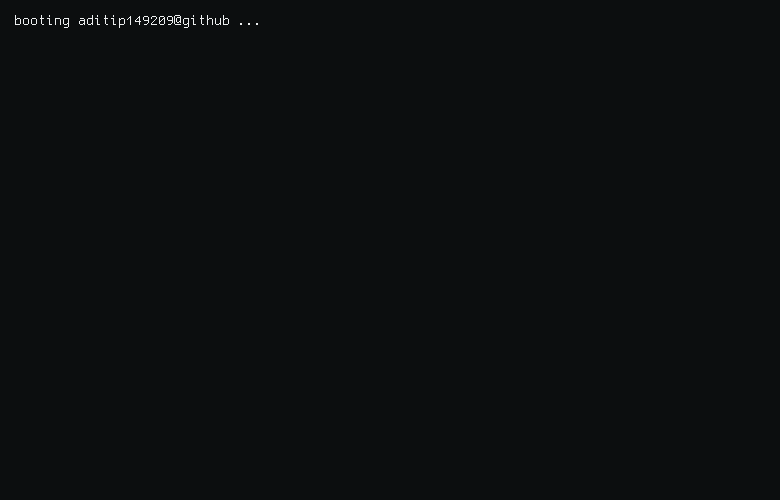

<picture>
  <source media="(prefers-color-scheme: dark)" srcset="output.gif">
  <source media="(prefers-color-scheme: light)" srcset="output.gif">
  
</picture>

## About

This profile GIF is generated with [github-readme-terminal](https://github.com/x0rzavi/github-readme-terminal) and updated automatically. It highlights live GitHub stats for [aditip149209](https://github.com/aditip149209) alongside a retro terminal layout tuned for a forest / sage palette.

## Regeneration

Run `python script.py` to rebuild the GIF locally.

## Secrets

If you want the GitHub stats and upload flow to run in GitHub Actions, add these repository secrets manually:

- `GITHUB_TOKEN` for GitHub API access used by the script
- `IMGBB_API_KEY` if you want the workflow to publish the GIF to ImgBB before updating the README

Generated automatically on 2026-07-13 14:48 UTC.
