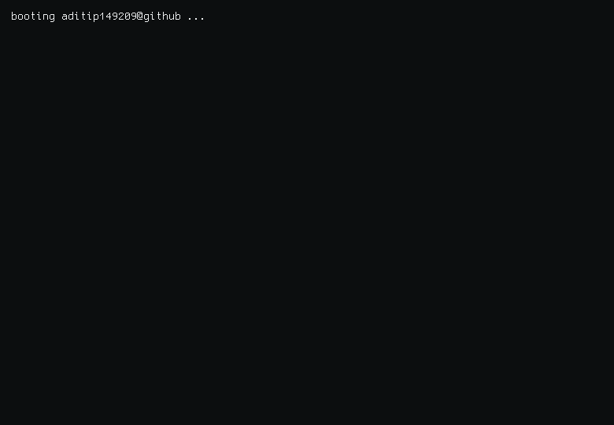

<picture>
  <source media="(prefers-color-scheme: dark)" srcset="output.gif">
  <source media="(prefers-color-scheme: light)" srcset="output.gif">
  
</picture>

## About

Hi, I'm Aditi Pandey. I work across OSS and backend systems, with open-source contributions around Kyverno and Golang, including CEL policy metrics work. I also spent time on Sprinklr backend and LLM infrastructure work, and I’m keeping a steady Codeforces practice streak as part of my competitive programming goals. I’m part of IRIS NITK as well, and the GIF above pulls those same themes together in a retro terminal style.

## Regeneration

Run `python script.py` to rebuild the GIF locally.

## Secrets

If you want the GitHub stats and upload flow to run in GitHub Actions, add these repository secrets manually:

- `GITHUB_TOKEN` for GitHub API access used by the script
- `IMGBB_API_KEY` if you want the workflow to publish the GIF to ImgBB before updating the README

Generated automatically on 2026-08-01 07:00 UTC.
